# Reliable long recordings

Status: implemented in the native client and packaged TypeScript server, with integration and long-duration validation recorded below. The source audit describes the original three-minute path; legacy v1 endpoints retain that behavior for compatibility.

## Agreed behavior

- A recording should comfortably last 30 minutes or longer. Thirty minutes is a validation milestone, not a new automatic cutoff; exercise 60- and 120-minute sessions too.
- Process audio while recording, then insert the assembled transcript once the user stops and processing finishes.
- Require an available server under the existing authentication policy to start; tokenless localhost remains supported. Persist its accepted settings snapshot before admitting microphone audio. Starting a new recording offline remains unavailable.
- After a session starts, network or inference failures must not discard captured audio. Save locally, resume transfer, and finish processing when the server recovers.
- Keep the current native macOS capture and Whisper/Qwen backends. Their bounded request sizes can remain internal safeguards.

## What exists and what breaks

The client already writes audio incrementally and uploads approximately half-second PCM batches. The server streams those batches into raw files. After stop, it seals whole-session WAV files, runs one Whisper request, processes the entire transcript, and delivers one result. Helpers stay loaded across requests.

| Area | Evidence in the current code | Consequence for long sessions |
| --- | --- | --- |
| App duration | `Sources/SottoCore/LifecyclePolicy.swift:4`, `Sources/Sotto/SottoController.swift:1138`, `Sources/Sotto/System/AudioRecorder.swift:472` and `:553` | Timer and both audio streams independently stop/clip at 180 seconds. |
| Network coupling | `Sources/Sotto/SottoController.swift:273` and `:830`, `Sources/Sotto/ServerClient.swift:131` | One failed health poll, upload error, or 512-event backlog can cancel recording. |
| Client durability | `Sources/Sotto/System/AudioRecorder.swift:368`, `:455`, `:607`; `Sources/Sotto/SottoController.swift:204`, `:880`–`:903` | Temporary files are deleted on failure/startup and after upload acknowledgments, before finish is confirmed. No persistent upload recovery. |
| Capture backlog | `Sources/Sotto/System/AudioRecorder.swift:397`–`:414` | PCM copies accumulate on an unbounded dispatch queue if conversion/storage stalls. This risk has not been profiled. |
| Interruptions | `Sources/Sotto/System/AudioRecorder.swift:234`–`:293`; `Sources/Sotto/SottoController.swift:1035`–`:1054` | Sleep, lock, device loss, and route changes discard unfinished audio. No evident watchdog for a driver that stops producing frames. |
| Session expiry | `Server/src/generation-service.ts:302`–`:310` | Uploads expire after 45 seconds of inactivity or five minutes total age, even while audio continues arriving. |
| Server recovery | `Server/src/generation-service.ts:150`, `:270`–`:280`, `:617`–`:626`, `:1248` | Audio is synced, but upload receipts/manifests live in memory. Restart marks unfinished records failed and removes raw uploads. |
| Upload bounds | `Server/src/generation-service.ts:508` and `:587`; `Server/api/openapi.yaml:183` | 4,096 chunks and 256 MiB per stream. Chunk count is roughly 34 minutes at half-second batching; original audio reaches the byte cap sooner. |
| Inference admission | `Server/src/generation-service.ts:429`, `:1055`, `:1147` | One active generation holds the server during both capture and processing; Whisper starts only after stop. |
| WAV sealing | `Server/src/generation-service.ts:953`–`:1010`; `Server/src/storage.ts:95` | Sealing copies the whole raw stream while holding the global mutation queue. Disk temporarily contains both copies; fixed reserve is only 100 MiB. RIFF length fields are 32-bit. |
| Speech request | `Engine/worker.cpp:51`, `:112`, `:129`, `:133`; `Server/src/inference/native-inference.ts:49` | Whole WAV must fit 180 seconds/32 MiB, is loaded into RAM, and has a 180-second processing deadline. |
| Boundary evidence | `Engine/worker.cpp:304`, `:332` | Whisper decodes with timestamps but returns concatenated plain text. Overlapping requests cannot yet be stitched reliably. |
| Dictionary | `Server/src/generation-service.ts:1076`; `Server/src/domain/dictionary.ts:239`–`:250` | If substituted output exceeds 24 KiB, the entire dictionary operation returns its source text. Long takes can lose all substitutions for that call. |
| Proofreading | `Server/src/generation-service.ts:1182`; `TextEngine/README.md:20`–`:22`; `Server/src/domain/correction.ts:318` | Whole-take cleanup skips beyond 6,000 graphemes; context/output/deadline and quadratic validation are also bounded. Raising these bounds would create new resource risks. |
| List composition | `Server/src/domain/lists.ts:749`, `:852`; `Server/src/domain/composition.ts:42`; `Server/src/generation-service.ts:1028` | Current list/composition state describes completed, delivered takes. Each call flushes its tail; acoustic chunks could create extra list items or lose prose. |
| Events/history | `Server/src/generation-service.ts:234`, `:294`, `:722`, `:1213`; `Sources/Sotto/ServerClient.swift:266` | Full records with several text copies are loaded/resend; metadata is capped at 1 MiB, event lines at 2 MiB, client resource requests at five minutes. This gets expensive if reused for incremental processing. |

Approximate uncompressed storage per 30 minutes, excluding headers, overlap, temporary copies, and backups:

| Audio | Bytes | MiB |
| --- | ---: | ---: |
| Inference, 16 kHz mono float32 | 115,200,000 | 110 |
| Original, 48 kHz mono float32 | 345,600,000 | 330 |
| Original, 48 kHz stereo float32 | 691,200,000 | 659 |

The current original-audio cap is reached after about 23.3 minutes at 48 kHz mono, or 11.7 minutes at stereo. Higher-channel/rate devices cost substantially more. Original retention defaults on. Keep fidelity and existing retention semantics for the first implementation; compression can be evaluated separately.

## Proposed architecture

```mermaid
flowchart LR
    Mic[Microphone] --> Spool[Durable local audio]
    Spool --> Transfer[Resumable WebSocket uploader]
    Transfer --> Store[Durable server audio and receipts]
    Store --> Speech[Bounded Whisper windows]
    Speech --> Text[Bounded text processing]
    Text --> Transcript[Ordered session transcript]
    Transcript --> Finish[Stop and finalize remaining tail]
    Finish --> Insert[One guarded insertion]
```



There are three independent boundaries:

- **Transport batches** are small numbered binary messages, with a bounded amount in flight.
- **Storage segments/checkpoints** make acknowledged audio recoverable without sealing/copying an entire session.
- **Speech and text windows** are selected for recognition quality and model/token budgets. They need not match transport or storage boundaries.

Keep one logical recording and one history entry. Avoid exposing internal segments as separate takes.

### Durable recording ownership

Create a persistent local session under the client data directory rather than the OS temporary directory. Save its server ID, request ID, endpoint identity, accepted settings, capture-run IDs/formats/timing, frame counts, upload positions, stop/finish state, and recovery status. Credentials remain in Keychain. Pin the destination server for the session, as the current client already does. Store new server sessions in a separate namespace such as `sessions/`, outside legacy `generations/` startup scans; old/reference servers reject unfamiliar generation schemas and fail unfinished legacy records.

Write recoverable PCM with atomic manifests/checkpoints or short sealed storage files. Do not assume an open `AVAudioFile` has a crash-readable WAV header. Perform disk sync and checkpoint work off the real-time callback. Define and measure the maximum uncheckpointed tail; completed checkpoints must survive crashes, and the UI must not report an uncommitted tail as durably saved.

The uploader reads committed ranges from disk. Only a small bounded buffer stays in RAM. A lost connection changes synchronization state rather than capture state. Retain each range locally until the server confirms durable ownership of its audio and recovery metadata. Retain enough state to retry session finalization after an ambiguous finish response.

Separate explicit discard from interruption. Startup scans pending sessions and reconciles them with the server instead of deleting orphans. Server restarts requeue unfinished work instead of deleting acknowledged audio.

### WebSocket transport

Use `URLSessionWebSocketTask` on macOS and a Fastify-compatible WebSocket route on the server, such as `@fastify/websocket`. Reuse the existing endpoint validation/authentication rules: HTTPS becomes WSS, permitted local/Tailscale HTTP becomes WS, and bearer authentication uses request headers. A reconnect cannot redirect audio to a different endpoint or device/session.

Use the socket for binary PCM upload and compact control/status messages. Existing HTTP remains useful for admission, authoritative reconciliation, history, and downloads. HTTP requests may already share a pooled TCP connection; WebSocket principally removes per-batch HTTP request/response overhead and permits controlled pipelining.

Illustrative protocol shape, to formalize in the contract:

```text
resume(sessionID, lastKnownRevision)
server snapshot(connectionEpoch, per-run positions, revision, states, stop intent)
audio(connectionEpoch, captureRunID, kind, sequence, formatID, firstFrame, frameCount, checksum, PCM)
ack(captureRunID, kind, nextSequence, durableFrameCount, uploadCredits, revision)
progress(uploadedFrames, transcribedFrames, proofreadFrames, revision)
stop(connectionEpoch, exact per-run captured frame totals)
finalized(transcript revision, delivery eligibility)
```

- Sequence/format/offsets are explicit per stream. Numbers must not depend on a lifetime 4,096-chunk ceiling.
- Resume grants a connection epoch/lease and fences superseded connections; a delayed old socket cannot append or stop after replacement.
- Identify each capture run and its format, exact source/inference intervals, and monotonic session timing. Do not sum original frames across unlike sample rates/channels; persist gaps when capture pauses.
- Retry of the same message is idempotent; conflicting content at the same sequence is rejected. Validate payload size, finite samples, format, and whole-frame alignment.
- Acknowledge only after audio and its receipt journal are recoverable. Crash between data sync and journal commit leaves an uncommitted suffix to reconcile/truncate, not a falsely acknowledged batch.
- Reconnect from the server's authoritative durable positions. A server-committed batch whose acknowledgment was lost must be safe to replay.
- Bound in-flight **bytes**, including original audio, rather than callback/message count. Stop sending when the server applies backpressure; capture continues to local disk.
- Configure WebSocket `maxPayload` and bounded receive/write queues before decoding/enqueueing PCM; HTTP body limits do not constrain socket messages. Enforce server-side upload credits so an overproducing client cannot bypass the window.
- Batch size and acknowledgment cadence are tunable. Around 100–250 ms transport messages are an experiment, not a quality/reliability requirement. Checkpoint/ack batching can use a different cadence.
- Keep control/progress responsive when original audio is large. Do not allow unbounded socket send queues; give inference audio/control priority or use separate bounded channels if profiling warrants it.
- Use compact revisions plus snapshot reconciliation after reconnect. Correctness must not depend on every transient progress message being delivered.
- Persist stop intent before accepting it: the first accepted request fixes per-run endpoints; identical repeats are idempotent and different totals reject. Forbid audio beyond those endpoints. Finalization waits for complete contiguous durable coverage, while reconciliation reports stop intent and any final revision. The client's stopped state persists even if the message/response is lost.

A live socket is an optimization and communication channel. The persisted data/receipt protocol provides recovery.

### Incremental speech and text

Start with roughly 30–60-second Whisper windows, preferring conservative silence boundaries and using short acoustic overlap when necessary. Benchmark the actual durations and overlap. Current VAD only gates whole requests; expose useful boundary information or implement a separate bounded segmentation pass. Keep all original captured audio, including pauses.

Extend `Engine/worker.cpp` and `native-inference.ts` to return timed spans and, where needed, word/token alignment evidence. Map local timestamps to absolute session frame ranges. Reconcile overlaps using timing plus boundary alignment; naive string deduplication can delete intentional repetition. If boundary evidence is ambiguous, re-decode a bounded joined region and retain a provisional tail rather than silently drop words. Bound expansion and retry attempts; repeated ambiguity becomes durable unresolved boundary work and a visible incomplete state, not an ever-growing tail. Continuous speech with no pause must still make progress.

Persist completed speech results and their source/result revisions. Process segments in order or assemble by explicit audio interval, never by response arrival order. Retry a failed window and its affected dependency range: changed ASR output can invalidate neighboring overlap reconciliation and downstream dictionary/list/correction state. Persist formatting checkpoints so unrelated earlier work remains reusable. A speech failure remains a visible gap and blocks a claim of complete transcription. Helpers remain warm, and concurrent requests per helper remain bounded. Previous-text context, if later shown beneficial, must be explicit and confined to the same session; preserve the current default context reset until evaluated.

Build text windows from reconciled sentences/list items, independent of acoustic cuts. Keep existing Qwen token/output/deadline and rewrite-validation safeguards per window. Add helper tokenizer preflight or structured budget feedback: the coordinator cannot currently inspect the helpers' exact token budget. Budget actual framing, custom prompt, vocabulary, target text, context, and reserved output; character limits alone are insufficient. Check expected target output capacity too, since reserving 2,048 output tokens does not ensure a multilingual 6,000-grapheme target fits.

Add session formatting state for an unfinished sentence, open list item, pending list control, and nearby spoken-correction tail. For example, cuts inside `Make it 42, sorry, 24`, `Do merge, correction, do not merge`, a multiword dictionary alias, or `next item` must preserve their existing semantics. If a sentence/list item exceeds the working budget, persist its older content, retain only a bounded editable suffix, and continue the same open item without generating another number. Never wait indefinitely for a terminator; keep deterministic text when a span cannot be safely proofread. Distinguish finalized prefix from editable tail and retain durable raw evidence. This design supports nearby repairs and does not promise arbitrary backwards edits to finalized text.

Apply dictionary rules with sufficient boundary lookbehind, without placing the text-helper's 24 KiB ceiling on an entire session. A proofreading rejection/timeout keeps that window's deterministic text and allows later windows to proceed. Keep diagnostics per window. A session assembler retains every finalized span; do not repeatedly use delivery-oriented `composeDictation` or its 15-minute inter-take continuation for internal chunk state.

At stop, persist exact source/inference frame counts, upload the remainder, close open audio/text tails, validate contiguous coverage and formatting, then assemble the final transcript. Do not send a whole-session transcript back through Qwen or quadratic rewrite validation.

### Scheduling, storage, and UX

- Separate capture/synchronization state from processing state; they now happen concurrently. Expose saved/uploaded/transcribed frame totals and pending work.
- Require durable server admission at start, but allow model warming/recovery or a processing backlog after admission. Keep native helper concurrency limited; queued jobs and session leases are persistent. Admission and scheduling can remain simple without implementing concurrent model inference.
- Replace absolute upload-age cancellation with a renewable lease. Inactivity may mark a session interrupted and release admission resources, but must preserve acknowledged audio. Cleanup of abandoned durable recordings is an explicit retention decision.
- Keep segment audio as the canonical archive. Stream/reconstruct playback/downloads or build exports on demand. Avoid mandatory whole-session WAV copies and handle RIFF size limits before any large WAV export. Original formats may differ across a paused/resumed capture run; each run needs its own format and timeline metadata.
- Budget local/server disk headroom for pending audio, checkpointing, processing windows, and export work. Detect low disk early. On an actual storage failure, stop safely and preserve the completed prefix; never silently drop samples or delete the session.
- Use a bounded capture buffer pool/queue, independent of network backpressure. Monitor last received frames and queued writer work so the UI cannot imply healthy recording during a stalled driver.
- Remove elapsed-clock clipping and countdown copy after the new flow is available. Preserve layout stability. Show a concise synchronization/interruption state when action is useful.
- Make start/stop available without holding a modifier for half an hour. Keep existing hold-to-talk for short dictation; a recording toggle can use the same session pipeline.
- Prevent idle system sleep during active recording with a scoped power assertion. Genuine sleep, device loss, and app quit must checkpoint/preserve the prefix. Proposed lock behavior: continue capture where the OS permits it and suppress delivery while locked; otherwise persist a paused/interrupted state. Explicit resume starts a new capture run and records gaps honestly.
- Compact session events and history summaries must not contain every diagnostic/full-text variant. Fetch paged transcript spans/detail on demand and materialize the final text when copying/inserting.
- Keep one guarded insertion after finalization. Revalidate destination/caret and retain existing fallback behavior. Persist delivery-attempt state to prevent duplicates; a recovered session or ambiguous paste must never automatically replay insertion after reconnect/relaunch. Large pastes need real editor validation; do not split them into independently retried insertions.

## Implementation phases

1. **Contract and durable state.** Add session/segment/checkpoint models, independent capture/sync/processing state, reconciliation, and capability negotiation. Define exact ACK and finish semantics. Use versioned storage with `atomicPrivateWrite` plus bounded journals/manifests; keep full transcripts outside small metadata. Isolate new sessions in `sessions/` with a separate versioned route family, such as `/v2/recordings`, and WebSocket subprotocol. Advertise long-recording support only when the complete path is ready. Preserve legacy routes and readability of existing recordings/imports; avoid writing unfamiliar session models or enum values into legacy generation storage/wire responses.
2. **Durable local capture and server recovery.** Replace temporary ownership/orphan deletion, persist admission/settings, checkpoint audio, bound the writer queue, and preserve interruptions. Persist server upload receipts and recover queued processing on restart. Remove destructive cleanup paths for the new protocol. Validate crashes before enabling long sessions.
3. **Resumable live transfer.** Add the authenticated WebSocket endpoint/client, disk-backed uploader, durable ACKs, bounded in-flight bytes, reconnect reconciliation, and idempotent stop/finalization. Remove health-poll/upload-error cancellation from admitted recording. Keep HTTP admission/history/downloads.
4. **Speech processing during capture.** Seal bounded storage ranges, schedule speech windows before stop, extend timed helper results, reconcile boundaries, checkpoint window results, and retry failed work. Decouple helper scheduling from session capture/admission. Report genuine backlog without stopping capture.
5. **Incremental text and assembly.** Add mutable tails/session list state, boundary-aware dictionary processing, tokenizer-budgeted proofreading windows, diagnostics, ordered transcript assembly, compact events/history, and final coverage checks. Preserve existing correction/list behavior with boundary fixtures.
6. **Enable long sessions and validate delivery.** Remove session-duration/byte/chunk ceilings that assume one take, keeping per-request/window resource bounds and disk controls. Update recording toggle, feedback, interruption/recovery UI, archive playback, and single final insertion. Ship only after the sustained and failure tests below pass.

Primary implementation files: `Sources/Sotto/System/AudioRecorder.swift`, `AudioCaptureSession.swift`, `InputOnlyAudioUnit.swift`, `Sources/Sotto/ServerClient.swift`, `SottoController.swift`, `RecordingFeedback.swift`, `AppState.swift`, `Sources/SottoAPI/API.swift`, `Server/api/openapi.yaml`, `Server/src/generation-service.ts`, `http-server.ts`, `storage.ts`, `inference/native-inference.ts`, `Engine/worker.cpp`, and the text/domain pipeline. Split capture persistence, transfer, segment scheduling, and transcript assembly into focused modules rather than expanding both large controllers indefinitely. Regenerate Swift/TypeScript API bindings when the contract changes.

The packaged coordinator is TypeScript. Keep existing legacy parity tests for the reference Swift server; new session capabilities should not require maintaining a second coordinator implementation. Document that capability difference explicitly. Run `bun run fmt` after any TypeScript edits, then appropriate type/API/unit checks.

## Acceptance and evidence

- **Duration:** 30-, 60-, and 120-minute sessions finish without a duration-induced stop. Exact captured/uploaded frame totals and transcript interval coverage reconcile. An hour-long silence/continuous-speech mix must also work.
- **Bounded work:** profile client writer/socket queues, server memory, helper memory, disk, and backlog. Active audio/model buffers are bounded by windows rather than total audio duration; large text is paged or materialized on demand.
- **Recovery:** inject loss before/after audio sync, journal commit, ACK, segment processing commit, stop, and finalization. Restart client/server/helper at those points. No acknowledged prefix is lost, and replay duplicates neither audio nor text. Quantify any active uncheckpointed tail.
- **Network:** disconnect for minutes after successful online start, keep recording locally, reconnect and catch up. Test lost ACKs, corrupt/conflicting replay, backpressure, credential rejection, and server restarts. Starting offline must still fail before microphone capture.
- **Boundaries:** real speech across many cut offsets, quiet word endings, names/numbers, negations, intentional repeated phrases, no-pause speech, silence, and noise. Split existing repair/list/dictionary fixtures across every relevant word boundary; validate controls, numbering, repairs, and offset accounting.
- **Resource failures:** low disk, slow/stalled writer, device loss, format change, screen lock, sleep, and app quit preserve recoverable completed audio and expose honest gaps/state. No false healthy waveform/clock when frames stop.
- **Partial inference:** a failed speech window remains retryable and cannot silently produce a complete result; a failed proofread window preserves deterministic text. Reprocessing invalidates dependent formatting/tail results predictably.
- **Throughput:** measure ASR/cleanup real-time factor, backlog, and stop-to-result latency on named supported Apple Silicon, Linux CPU, and CUDA hosts. Tune windows/overlap and prioritize speech if proofreading competes for compute. Slower hardware can finish later without losing the recording; do not promise instant completion on every host.
- **Delivery:** one final insertion in supported native/Electron/browser editors; changed caret/focus, locked screen, large text, paste uncertainty, disconnect, and relaunch never cause duplicate/stale insertion.
- **Compatibility:** old recordings/imports remain readable, old clients receive a usable negotiated contract, and old servers cannot silently clip a new long session.

The implementation preserves per-window model safeguards and exposes failed speech work instead of silently claiming completion. Native vendor submodules and local models were used for helper and accelerated audio checks. Speech recognition quality, hardware throughput, and large-editor insertion require broader validation; accelerated fixtures do not establish a wall-clock microphone soak or results on other hardware.

## Implemented behavior and validation

- Online capability negotiation and durable admission precede microphone capture. New sessions use isolated `sessions/` storage and v2 routes; legacy generations and the reference Swift server remain compatible.
- Local capture coalesces privately stored PCM into at most 250 ms batches per stream and publishes original/inference positions together after their intervals align. The callback writer admits at most 8 MiB and two seconds of source audio. Orderly stop/interruption drains capture; an abrupt crash can lose the writer/converter tail in addition to the unpublished batches. A missing-frame watchdog and low-disk checks preserve the committed prefix.
- WebSocket transfer pins endpoint/authentication, validates checksums and exact ACK positions, fences old connections, and reconciles lost ACKs after reconnect. One batch is in flight; high network latency can create a safe disk backlog. Processing and transfer failures do not cancel admitted capture.
- Whisper processes bounded windows during capture, retaining a provisional tail and using bounded fresh re-decoding for ambiguous overlap. Token timing anomalies fall back to segment envelopes. Qwen, dictionary, spoken correction, and list processing use bounded text windows and persistent formatting state.
- Interrupted sessions preserve closed run totals and timestamps/gaps. History exposes explicit Resume, Finish, and Discard. Resume adds a new capture run; launch recovery never restarts the microphone or pastes text. Mixed original formats have per-run exports.
- Final stop is durable and idempotent. It validates complete contiguous source/inference coverage before composing one transcript and making one guarded delivery attempt. WAV export is on demand with RIFF guards and immediately unlinked temporary descriptors.
- Synthetic native capture reaches exact 30-, 60-, and 120-minute frame milestones. Service fixtures cover those logical durations, restart/lost-ACK recovery, immutable stop/pause totals, epoch fencing, durable journals, original-audio alignment, proofreading fallback, and cross-take list continuation. Compiled WebSocket integration tests exercise the production transport.
- Native Whisper and MLX proofreading helper smoke suites pass with local models and public/synthetic fixtures. Actual long-audio measurements and final package/CI results are recorded in the PR. A live microphone soak, cross-platform throughput measurements, and manual large-paste checks in every supported editor remain validation limits.
- On Apple M5 Max, an accelerated 30-minute repeated public JFK fixture completed all 28,800,000 inference frames in 62.4 seconds with proofreading disabled. The final transcript contained 163 `ask not` occurrences, matching the 163 complete fixture repetitions; this is a repetition regression check, not word-perfect recognition evidence. Coordinator RSS was 156 MiB; a native speech-helper sample was approximately 1.87 GiB. Final local validation passed 247 server tests and 362 Swift tests.

## Condensed changes

- Keep online admission and one final insertion.
- Make admitted capture durable and independent of networking/inference progress.
- Stream numbered PCM over WebSocket with durable receipts, reconnect, and backpressure.
- Process and checkpoint bounded speech/text windows during recording.
- Assemble one transcript with explicit boundary/list/correction state.
- Replace duration ceilings with measured resource controls, recovery, and sustained-session validation.
